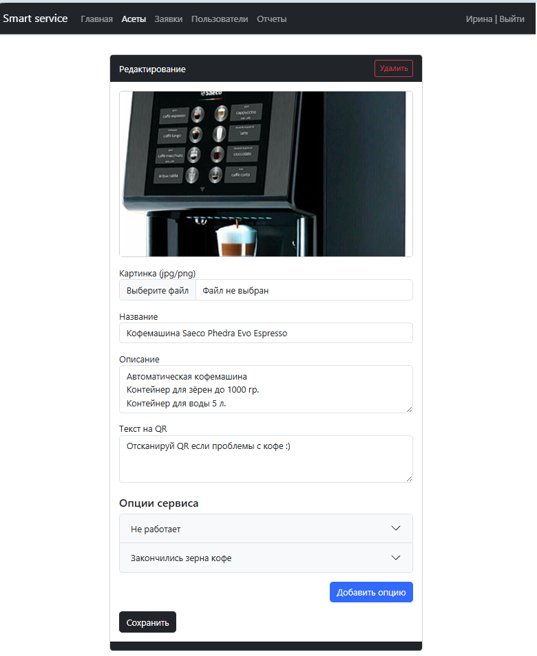
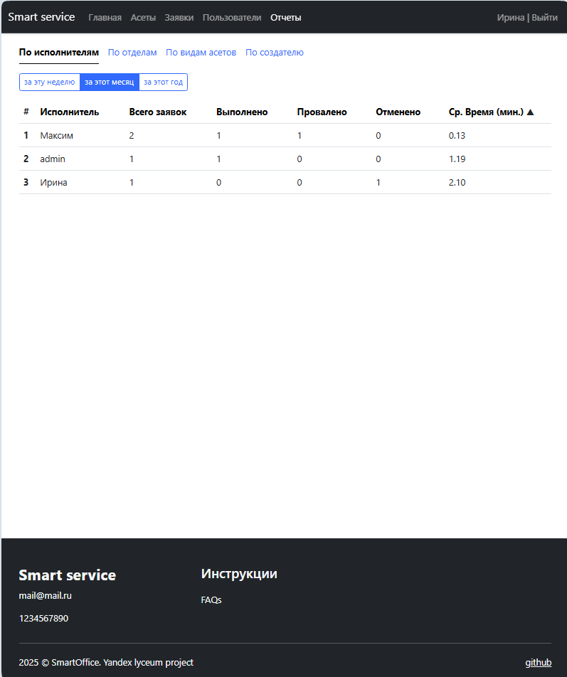

# Smart Service - Умное управление офисными сервисами

Проект для автоматизации обслуживания офисного оборудования и ресурсов через систему заявок с QR-кодами.

## О проекте

Smart Service - это веб-приложение, которое позволяет сотрудникам быстро сообщать о проблемах с офисным оборудованием (
кофемашины, принтеры, компьютеры и т.д.) и запрашивать обслуживание (пополнение расходников, уборку и др.).

> [Презентация проекта](docs/smart_service.pptx)

### Основные возможности:

- 📌 QR-коды на каждом устройстве для быстрого доступа к сервису
- 📝 Простая подача заявок сотрудниками
- ⚙️ Автоматическое распределение заявок по отделам
- 📊 Аналитика работы для руководителей
- 🔐 Ролевая модель доступа (сотрудник, исполнитель, менеджер, руководитель)

### Структура проекта

```
smart_service/
├── app/                # Основное приложение
│   ├── auth/           # Модуль авторизации
│   ├── assets/         # Управление ассетами
│   ├── core/           # Базовые компоненты
│   ├── reports/        # Отчеты для руководителей
│   ├── tickets/        # Управление заявками
│   ├── users/          # Управление пользователями
│   └── ...             # Другие модули
├── nginx/              # Конфигурация Nginx
├── tests/              # Тесты
└── docker-compose.yml  # Конфигурация Docker
```

### Роли пользователей

1. Сотрудник - подает заявки через QR-коды
2. Исполнитель - обрабатывает заявки
3. Менеджер пользователей - управляет учетными записями
4. Менеджер асетов - добавляет оборудование в систему
5. Руководитель - анализирует отчеты

### Документация

* [Техническое задание](docs/tz.md)
* [User Stories](docs/user_stories)
* [Описание ролей](docs/user_stories/roles_list.md)

## Технологический стек

- **Backend**: Python 3.13, Flask
- **Frontend**: HTML, CSS, Bootstrap
- **База данных**: PostgreSQL
- **Деплой**: Docker, Nginx, Certbot (SSL)
- **Дополнительно**: Flask-SQLAlchemy, Flask-Login, Flask-WTF, Pillow, Qrcode

## Установка и запуск

### Требования:

- Проект разрабатывался на версии `Python 3.13`
- Совместимость с версиями ниже не проверялась

- Docker (для postgres)
- Docker Compose (для postgres)

### Запуск:

1. Склонируйте репозиторий:
   ```bash
   git clone https://github.com/Tulishka/smart_service.git
   ```
   ```bash
   cd smart_service
   ```

2. Создайте файл .env на основе .env.example и заполните необходимые переменные окружения.

   ```bash
   cp example.env .env
   ```

> #### `.env`
> Обратите внимание на строку подключения к БД (`DATABASE_URL`)
> - если предполагается использовать `postgres` укажите правильный адрес сервера:
>   - при запуске локального дев-сервера (run.py) адрес postgres `127.0.0.1`
>   - при запуске приложения в докере (web) адрес postgres `postgres`
> - если предполагается использование `SQLite`
>   - `DATABASE_URL` - должна остаться закомментированной

### Запуск проекта в Docker

- Определите конфигурацию
  - нужен ли postgres
  - нужен ли nginx
- проверьте и отредактируйте `docker-compose.yml` и `.env`
- если используется `postgres`
  - `DATABASE_URL` в `.env`, адрес должен быть `postgres`

#### Для локального запуска:

#### С `postgres`
   ```bash
   docker compose up -d web postgres
   ```
#### Без `postgres`
   ```bash
   docker compose up -d web
   ```

> Проект будет доступен по адресу `http://localhost:5000`

#### Для продакшин:

- убедитесь что SSL сертификаты успешно получены

   ```bash
   docker compose up certbot
   ```

- запуск проекта

   ```bash
   docker compose up -d web nginx postgres
   ```

> Проект будет доступен по адресу `https://your_domain:80`


### Локальный запуск проекта

- создайте и активируйте виртуальное окружение

```bash
   python -m venv venv
```

Если у вас `windows`:

```bash
   venv/Scritps/activate
```

Если у вас `MacOS` или `linux`:

```bash
   source venv/bin/activate
```

- установите зависимости

```bash
pip install -r requirements.txt
```

- В случае использования `postgres` запустите контейнер

   ```bash
   docker compose up -d postgres
   ```

- проект готов к запуску в dev-режиме:

```bash
python run.py
```

> Проект будет доступен по адресу `http://localhost:5000`

### Тесты API (pytest)

1. Установить dev-зависимости:
```bash
pip install -r dev-requirements.txt
```
2. Запустить тесты:
```bash
pytest
```

### Авторы

- Прийменко Ирина
- Михеев Максим


### Скрины






