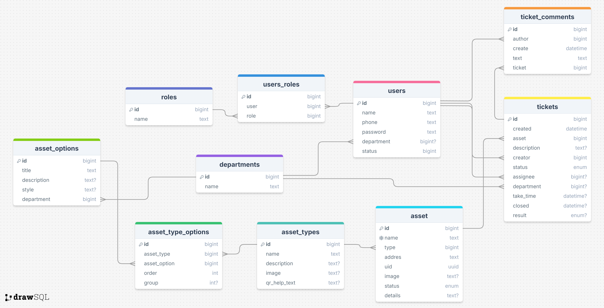

# Smart service

### Идея

В нашем умном офисе всё что может поломаться, и всё что требует обслуживания (кончился сахар, кофе, бумага в принтере,
еда в автомате, нужна уборка в помещении) обклеено Qr кодами
Например: Кофемашина, принтер, холодильник, компьютер или ноут сотрудника.
(надо узнать что бывает в офисе)

Когда возникает какая-то проблема (оборудование работает не правильно, нужна помощь (инструкция), закончились расходники
и т.д.) сотрудник сканирует Qr код и попадает на связанную с этим устройством страницу если он уже был авторизован на
сайте ранее, иначе он должен авторизоваться.

На странице устройства пользователь видит страницу в соответствии с его доступами. Нажатием на кнопку он может создать
заявку на решение проблемы и написать комментарий

### Процессы

* Процесс подачи заявки
* Процесс назначения заявки на исполнителя (у каждого исполнителя есть свой отдел, например: офис-менеджер или
  специалист техподдержки) происходит по заданным правилам, правила задаются таблицей: 1 колонка: класс сервиса, 2
  колонка: вид сервиса, 3 колонка: вид проблемы (что в заявке указал пользователь), 4 колонка: отдел-исполнитель
* Процесс выполнения заявки - в дальнейшем можно сделать что бы в тг отправлялось уведомление
* Процесс управлением списков сервисов (добавление, удаление, изменение)

### Разделы сайта

* Страница авторизации
* Страница регистрации (Дополнительно внешняя система подтверждает права доступа сотрудника по API)
* Главная страница
* Страница конкретного сервиса (устройства) - то куда ведёт Qr код
* Журнал заявок (список заявок, который можно фильтровать по типам и по статусу выполнения)
* Страница заявки для исполнителя (устройство, какая проблема, кто исполнитель и статус выполнения, кнопки выполнения и
  отмены заявки)
* Отчёт о выполненных заявках за период для руководителя (можно вывести среднее время выполнения заявки, график кол-ва
  инцидентов по дням)
* Страница со списком сервисов (устройств) с кнопкой добавить новое

### План работ

#### Зафиксировать требования к проекту

* Написать user stories (от лица всех [ролей системы](user_stories/roles_list.md))

### Модули сайта

* main: Главная страница
* users: Управление пользователями, авторизация
* assets: Управление асетами
* tickets: Подача, обработка заявки
* reports: Отчёты
* api: API

#### Проектирование приложения

* Выделить отдельные блоки приложения
* Подобрать и создать структуру папок проекта (шаблон)
* Спроектировать БД

##### Схема данных



##### Структура проекта

```
smart_service/              # корень проекта
├── app/
│   ├── docs                # документация
│   │  ├── user_stories/    # user stories
│   │  └── tz.md
│   ├── data                # данные
│   │  └── database.db      #   здесь файл базы данных
│   ├── db         
│   │  └── all_models.py
│   ├── templates/          # общие HTML-шаблоны
│   ├── static/             # Статика
│   │  ├── img/
│   │  ├── css/
│   │  ├── js/
│   │  ├── tickets/         # некоторые модули могут иметь свою статику
│   │  ├── ...
│   │  └── assets/
│   │    └── uploads/       # загруженные фотки например
│   ├── core/               # общий, базовый код
│   │  ├── utils.py         #   вспомогательные функции
│   │  ├── exceptions.py    #   общие исключения
│   │  └── forms.py         #   если появятся общие формы
│   ├── auth/               # модуль авторизации
│   ├── users/              # модуль управление пользователями и их ролями (flask blueprint)
│   │  ├── templates/       #   html - шаблоны 
│   │  ├── routes.py        #   маршруты и хендлеры (WEB слой) вызываем функции из логики
│   │  ├── models.py        #   модели модуля (ORM)
│   │  ├── exceptions.py    #   файл для определения исключений модуля
│   │  └── forms.py         #   формы (классы)
│   ├── tickets/            # модуль управления заявками на обслуживание
│   │  ├── ...              #   все модули содержат типовые файлы (см. users)
│   ├── assets/             # модуль управления ассетами: виды ассетов, сами ассеты.
│   ├── reports/            # модуль отчеты для персонала и руководителей
│   ├── api/          # модуль реализует api
│   ├── __init__.py             # Инициализация flask приложения (app)
│   └── config.py             # Конфигурации
│   
├── tests/                # Тесты
├── deploy/          # докер-файлы или что выбирем для деплоя
├── .gitignore
├── README.md
├── requirements.txt      # Зависимости
├── dev-requirements.txt  # Дев-зависимости
└── run.py                # Файл запуска проекта
```

#### Реализация

* Создать основу модульного flask-приложения
    * Общие папки
    * Папки функциональных блоков
    * Конфиг flask приложение
    * Подключить в проект Flask-SQLAlchemy
* Создать модели раздела пользователей (users)
* Создать модели раздела асетов (assets)
* Создать модели раздела заявок на сервис(tickets)
* Добавить базовый шаблон HTML
* Добавить базовый шаблон HTML для форм
* Реализовать функцию login
    * Подключить Flask-Login
    * Сделать форму Login (Flask-WTF)
    * Сделать HTML шаблон для логина
    * Написать обработчик маршрута /login
* Реализовать функцию регистрации
    * Сделать форму регистрации
    * Сделать HTML шаблон
    * написать обработчик маршрута
* Добавить главную страницу
    * Создать шаблон главной страницы
    * Разместить ссылки на регистрацию и login
    * Предусмотреть выход пользователя
* Сделать страницу списка пользователей
    * Тестовое заведение пользователей
    * Выводить список пользователей
* Сделать заглушки на все разделы сайта
    * Пользователи
    * Заявки
    * Асеты
    * Виды асетов
    * отчёты
* Вывести на главную страницу ссылки на все разделы
* Дооформить шаблон главной страницы
    * Сделать шапку сайта
        * Добавить навигацию по разделам
        * Вывести текущего пользователя
        * Кнопка выхода
    * Сделать подвал сайта
        * Ссылки на документацию и инструкции
        * И другие полезные ссылки
* Добавить функционал назначения ролей
* Добавить функционал управления видами асетов
* Добавить функционал управления асетами
* Добавить функционал управления отделами
* Добавить функционал распределения сотрудников на отделы
* В списке асетов добавить возможность вывода на печать Qr кодов
* Добавить пользователя админ
* Сделать страницу асета
* Сделать страницу заявки на обслуживание
* Сделать страницу для сотрудника службы (исполнителя), на которой он видит заявки своего отдела
* Добавить отчёт для руководителя
* Добавить API (ресурс `users`)

Опционально:
* Добавить API (ресурсы `assets`, `tickets`)
* Добавить телеграм бот для уведомлений и восстановления пароля
* Добавить админку (Flask-Admin), для решения нетиповых вопросов